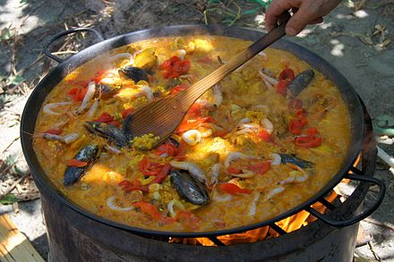
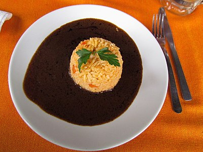

Different Cultures of Countries
=======
Ana Vaquera  
In-Class Exercise 5  
February 5, 2018  

This website concentrates on three different countries Spain, Mexico and Ecuador. These three countries, apart from the fact that they are all countries, also share the commonality that the majority of their population speaks Spanish. The official language for these three countries is Spanish, although in Ecuador they recognize Kichwa, Shuar and other indigenous languages. The reason these three countries were chosen was not only for their language but their share in culture. In many ways their culture can be considered similar especially when it concerns sports, for instance soccer, or football, plays an importance in each country.

## Spain
Culturally, Spain is a Western country. Almost every aspect of Spanish life is permeated by its Roman heritage, making Spain one of the major Latin countries of Europe. Spanish culture is marked by strong historic ties to Catholicism, which played a pivotal role in the country's formation and subsequent identity. Spanish art, architecture, cuisine, and music has been shaped by successive waves of foreign invaders, as well as by the country's Mediterranean climate and geography. The centuries-long colonial era globalised Spanish language and culture, with Spain also absorbing the cultural and commercial products of its diverse empire.

### Literature
The earliest recorded examples of vernacular Romance-based literature date from the same time and location, the rich mix of Muslim, Jewish, and Christian cultures in Muslim Spain, in which Maimonides, Averroes, and others worked, the Kharjas (Jarchas).

During the Reconquista, the epic poem Cantar de Mio Cid was written about a real man—his battles, conquests, and daily life.

Other major plays from the medieval times were Mester de Juglaría, Mester de Clerecía, Coplas por la muerte de su padre or El Libro de buen amor (The Book of Good Love).

During the Renaissance the major plays are La Celestina and El Lazarillo de Tormes, while many religious literature was created with poets as Luis de León, San Juan de la Cruz, Santa Teresa de Jesús, etc.

The Baroque is the most important period for Spanish culture. We are in the times of the Spanish Empire. The famous Don Quijote de La Mancha by Miguel de Cervantes was written in this time. Other writers from the period are: Francisco de Quevedo, Lope de Vega, Calderón de la Barca or Tirso de Molina.

During the Enlightenment we find names such as Leandro Fernández de Moratín, Benito Jerónimo Feijóo, Gaspar Melchor de Jovellanos or Leandro Fernández de Moratín.

During the Romanticism, José Zorrilla created one of the most emblematic figures in European literature in Don Juan Tenorio. Other writers from this period are Gustavo Adolfo Bécquer, José de Espronceda, Rosalía de Castro or Mariano José de Larra.

In Realism we find names such as Benito Pérez Galdós, Emilia Pardo Bazán, Leopoldo Alas (Clarín), Concepción Arenal, Vicente Blasco Ibáñez and Menéndez Pelayo. Realism offered depictions of contemporary life and society 'as they were'. In the spirit of general "Realism", Realist authors opted for depictions of everyday and banal activities and experiences, instead of romanticised or stylised presentations.

The group that has become known as the Generation of 1898 was marked by the destruction of Spain's fleet in Cuba by US gunboats in 1898, which provoked a cultural crisis in Spain. The "Disaster" of 1898 led established writers to seek practical political, economic, and social solutions in essays grouped under the literary heading of Regeneracionismo. For a group of younger writers, among them Miguel de Unamuno, Pío Baroja, and José Martínez Ruiz (Azorín), the Disaster and its cultural repercussions inspired a deeper, more radical literary shift that affected both form and content. These writers, along with Ramón del Valle-Inclán, Antonio Machado, Ramiro de Maeztu, and Ángel Ganivet, came to be known as the Generation of '98.

The Generation of 1914 or Novecentismo. The next supposed "generation" of Spanish writers following those of '98 already calls into question the value of such terminology. By the year 1914—the year of the outbreak of the First World War and of the publication of the first major work of the generation's leading voice, José Ortega y Gasset—a number of slightly younger writers had established their own place within the Spanish cultural field.

Leading voices include the poet Juan Ramón Jiménez, the academics and essayists Ramón Menéndez Pidal, Gregorio Marañón, Manuel Azaña, Maria Zambrano, Eugeni d'Ors, Clara Campoamor and Ortega y Gasset, and the novelists Gabriel Miró, Ramón Pérez de Ayala, and Ramón Gómez de la Serna. While still driven by the national and existential questions that obsessed the writers of '98, they approached these topics with a greater sense of distance and objectivity. Salvador de Madariaga, another prominent intellectual and writer, was one of the founders of the College of Europe and the composer of the constitutive manifest of the Liberal International.

The Generation of 1927, where poets Pedro Salinas, Jorge Guillén, Federico García Lorca, Vicente Aleixandre, Dámaso Alonso. All were scholars of their national literary heritage, again evidence of the impact of the calls of regeneracionistas and the Generation of 1898 for Spanish intelligence to turn at least partially inwards.

The two main writers in the second half of the 20th century were the Nobel Prize in Literature laureate Camilo José Cela and Miguel Delibes from Generation of '36. Spain is one of the countries with the most number of laureates with the Nobel Prize in Literature, and with Latin American laureates they made the Spanish language literature one of the most laureates of all. The Spanish writers are: José Echegaray, Jacinto Benavente, Juan Ramón Jiménez, Vicente Aleixandre and Camilo José Cela. The Portuguese writer José Saramago, also awarded with the prize, lived for many years in Spain and spoke both Portuguese and Spanish. Saramago was also well known by his Iberist ideas.

The Generation of '50 are also known as the children of the civil war. Rosa Chacel, Gloria Fuertes, Jaime Gil de Biedma, Juan Goytisolo, Carmen Martín Gaite, Ana María Matute, Juan Marsé, Blas de Otero, Gabriel Celaya, Antonio Gamoneda, Rafael Sánchez Ferlosio or Ignacio Aldecoa.

Premio Planeta de Novela and Miguel de Cervantes Prize are the two main awards nowadays in Spanish literature.

### Art
Artists from Spain have been highly influential in the development of various European and American artistic movements. Due to historical, geographical and generational diversity, Spanish art has known a great number of influences. The Mediterranean heritage with Greco-Roman and some Moorish and influences in Spain, especially in Andalusia is still evident today. European influences include Italy, Germany and France, especially during the Renaissance Spanish Baroque and Neoclassical periods. There are many other autochthonous styles such as the Pre-Romanesque art and architecture, Herrerian architecture or the Isabelline Gothic.

During the Golden Age we find painters such as El Greco, José de Ribera, Bartolomé Esteban Murillo and Francisco Zurbarán. Also inside Baroque period Diego Velázquez created some of the most famous Spanish portraits, like Las Meninas or Las Hilanderas.

Francisco Goya painted during a historical period that includes the Spanish Independence War, the fights between liberals and absolutists, and the raise of contemporary state-nations.

Joaquín Sorolla is a well-known impressionist painter and there are many important Spanish painters belonging to the modernism art movement, including Pablo Picasso, Salvador Dalí, Juan Gris and Joan Miró.

### Music and Dance
Spanish music is often considered abroad to be synonymous with flamenco, a West Andalusian musical genre, which, contrary to popular belief, is not widespread outside that region. Various regional styles of folk music abound in Aragon, Catalonia, Valencia, Castile, the Basque Country, Galicia, Cantabria and Asturias. Pop, rock, hip hop and heavy metal are also popular.

In the field of classical music, Spain has produced a number of noted composers such as Isaac Albéniz, Manuel de Falla and Enrique Granados and singers and performers such as Plácido Domingo, José Carreras, Montserrat Caballé, Alicia de Larrocha, Alfredo Kraus, Pablo Casals, Ricardo Viñes, José Iturbi, Pablo de Sarasate, Jordi Savall and Teresa Berganza. In Spain there are over forty professional orchestras, including the Orquestra Simfònica de Barcelona, Orquesta Nacional de España and the Orquesta Sinfónica de Madrid. Major opera houses include the Teatro Real, the Gran Teatre del Liceu, Teatro Arriaga and the El Palau de les Arts Reina Sofía.

Thousands of music fans also travel to Spain each year for internationally recognised summer music festivals Sónar which often features the top up and coming pop and techno acts, and Benicàssim which tends to feature alternative rock and dance acts.[208] Both festivals mark Spain as an international music presence and reflect the tastes of young people in the country.

The most popular traditional musical instrument, the guitar, originated in Spain.[209] Typical of the north are the traditional bag pipers or gaiteros, mainly in Asturias and Galicia.

### Cuisine
Spanish cuisine consists of a great variety of dishes which stem from differences in geography, culture and climate. It is heavily influenced by seafood available from the waters that surround the country, and reflects the country's deep Mediterranean roots. Spain's extensive history with many cultural influences has led to a unique cuisine. In particular, three main divisions are easily identified:

  
*Paella, a traditional Valencian dish*

Mediterranean Spain – all such coastal regions, from Catalonia to Andalusia – heavy use of seafood, such as pescaíto frito (fried fish); several cold soups like gazpacho; and many rice-based dishes like paella from Valencia and arròs negre (black rice) from Catalonia.

Inner Spain – Castile – hot, thick soups such as the bread and garlic-based Castilian soup, along with substantious stews such as cocido madrileño. Food is traditionally conserved by salting, like Spanish ham, or immersed in olive oil, like Manchego cheese.

Atlantic Spain – the whole Northern coast, including Asturian, Basque, Cantabrian and Galician cuisine – vegetable and fish-based stews like caldo gallego and marmitako. Also, the lightly cured lacón ham. The best known cuisine of the northern countries often rely on ocean seafood, like the Basque-style cod, albacore or anchovy or the Galician octopus-based polbo á feira and shellfish dishes.

### Sport
While varieties of football had been played in Spain as far back as Roman times, sport in Spain has been dominated by English style association football since the early 20th century. Real Madrid C.F. and FC Barcelona are two of the most successful football clubs in the world. The country's national football team won the UEFA European Football Championship in 1964, 2008 and 2012 and the FIFA World Cup in 2010, and is the first team to ever win three back-to-back major international tournaments.

Basketball, tennis, cycling, handball, futsal, motorcycling and, lately, Formula One are also important due to the presence of Spanish champions in all these disciplines. Today, Spain is a major world sports powerhouse, especially since the 1992 Summer Olympics that were hosted in Barcelona, which stimulated a great deal of interest in sports in the country. The tourism industry has led to an improvement in sports infrastructure, especially for water sports, golf and skiing.

Rafael Nadal is the leading Spanish tennis player and has won several Grand Slam titles including the Wimbledon 2010 men's singles. In north Spain, the game of pelota is very popular. Alberto Contador is the leading Spanish cyclist and has won several Grand Tour titles including two Tour de France titles.

## Mexico
Mexican culture reflects the complexity of the country's history through the blending of indigenous cultures and the culture of Spain, imparted during Spain's 300-year colonization of Mexico. Exogenous cultural elements have been incorporated into Mexican culture as time has passed.

The Porfirian era (el Porfiriato), in the last quarter of the 19th century and the first decade of the 20th century, was marked by economic progress and peace. After four decades of civil unrest and war, Mexico saw the development of philosophy and the arts, promoted by President Díaz himself. Since that time, as accentuated during the Mexican Revolution, cultural identity has had its foundation in the mestizaje, of which the indigenous (i.e. Amerindian) element is the core. In light of the various ethnicities that formed the Mexican people, José Vasconcelos in his publication La Raza Cósmica (The Cosmic Race) (1925) defined Mexico to be the melting pot of all races (thus extending the definition of the mestizo) not only biologically but culturally as well.

### Literature
Mexican literature has its antecedents in the literatures of the indigenous settlements of Mesoamerica. The most well known prehispanic poet is Nezahualcoyotl. Modern Mexican literature was influenced by the concepts of the Spanish colonialization of Mesoamerica. Outstanding colonial writers and poets include Juan Ruiz de Alarcón and Juana Inés de la Cruz.

Other writers include Alfonso Reyes, José Joaquín Fernández de Lizardi, Ignacio Manuel Altamirano, Carlos Fuentes, Octavio Paz (Nobel Laureate), Renato Leduc, Carlos Monsiváis, Elena Poniatowska, Mariano Azuela ("Los de abajo") and Juan Rulfo ("Pedro Páramo"). Bruno Traven wrote "Canasta de cuentos mexicanos" (Mexican tales basket), "El tesoro de la Sierra Madre" (Treasure of the Sierra Madre).

### Art
The painting is one of the oldest arts in Mexico. The cave painting in Mexican territory is about 7500 years old, and has been manifested in the caves of the Baja California Peninsula. Pre-Hispanic Mexico is present in buildings and caves, in Aztec codices, in ceramics, in garments, etc. .; examples of this are the Maya mural paintings of Bonampak, or those of Teotihuacán, those of Cacaxtla and those of Monte Albán.

The mural painting had an important flowering during the 16th century, the same in religious constructions as in houses of lineage; such is the case of the convents of Acolman, Actopan, Huejotzingo, Tecamachalco and Zinacantepec. It is said that they were mainly indigenous painters led by friars who made them. These were also manifested in illustrated manuscripts such as the Matrícula de Tributos.

For a time it was believed that the first European painter living in New Spain was Rodrigo de Cifuentes, an apocryphal artist who even came to be attributed works such as The Baptism of the Caciques de Tlaxcala, painting of the main altarpiece of the Convent of San Francisco in Tlaxcala. Among the native painters was Marcos Aquino. The religiosity of the Novohispanos ("New-spanish") made that the painting was important for the evangelization of the society, the friars realized the graphic skills of the natives, who enriched the baroque and mannerist style. The arrival of several European painters and some students from New Spain, such as Juan Correa, Cristóbal de Villalpando or Miguel Cabrera, who made the walls and altarpieces the main source of ideological and political expression of artists.

The painting of the 19th century had a very marked romantic influence, landscapes and portraits were the greatest expression of this era. Hermenegildo Bustos is one of the most appreciated painters of the historiography of Mexican art. They also emphasize in these years Santiago Rebull, José Salomé Pina, Félix Parra, Eugenio Landesio and his famous disciple, the landscaper José María Velasco Gómez, as well like Julio Ruelas.

The Mexican painting of the 20th century has achieved world renown with figures such as David Alfaro Siqueiros, José Clemente Orozco, Joaquín Clausell, Frida Kahlo and Diego Rivera, generation of idealists who marked the image of modern Mexico in the face of strong social and economic criticism. The Oaxacan School quickly gained fame and prestige, diffusion of an ancestral and modern culture, freedom of design is observed in relation to the color and texture of the canvases and murals as a period of transition between the 20th century and the 21st century.

Some of the most outstanding painters in the 21st century (current painters): Patricia Calvo Guzmán. She studied painting in Beijing. Her work, of marked oriental influence, recalls the cut paper figures of Mexico and China, mixing them with a rich chromatic range; Eliseo Garza Aguilar, painter and performer considered among the leading exponents of the provocative and reflective art of the Third Millennium; in search of a critical response from the spectators, he combines his pictorial work in the performances with theatrical histrionics; Pilar Goutas, a painter who uses oil on amate support, with strong influence from Jackson Pollock and Chinese calligraphy; Rafael Torres Correa settles his residence in Mexico in 2001 and joins the contemporary art workshop "La Polilla" in Guadalajara, and performs various plastic and scenographic projects.

Throughout history several prominent painters of different nationalities have expressed in their works the face of Mexico. Among the most outstanding we can mention Daniel Thomas Egerton, Carl Nebel, Thomas Moran, Édouard Manet and Leonora Carrington.

### Music and Dance
Mexican society enjoys a vast array of music genres, showing the diversity of Mexican culture. Traditional music includes mariachi, banda, norteño, ranchera and corridos; on an everyday basis most Mexicans listen to contemporary music such as pop, rock, etc. in both English and Spanish. Mexico has the largest media industry in Latin America, producing Mexican artists who are famous in Central and South America and parts of Europe, especially Spain.

Some well-known Mexican singers are Thalía, Luis Miguel, Juan Gabriel, Alejandro Fernández, Julieta Venegas, Gloria Trevi and Paulina Rubio. Mexican singers of traditional music are: Lila Downs, Susana Harp, Jaramar, GEO Meneses and Alejandra Robles. Popular groups are Café Tacuba, Caifanes, Molotov, Panda and Maná, among others. Since the early years of the 2000s (decade), Mexican rock has seen widespread growth both domestically and internationally.

According to the Sistema Nacional de Fomento Musical, there are between 120 and 140 youth orchestras affiliated to this federal agency from all federal states.[citation needed] Some states, through their state agencies in charge of culture and the arts—Ministry or Secretary or Institute or Council of Culture, or in some cases the Secretary of Education or the State University—sponsor the activities of a professional symphony orchestra or philharmonic orchestra so all citizens can have access to this artistic expression from the field of classical music. Mexico City is the most intense hub of this activity, hosting 12 professional orchestras sponsored by different agencies such as the National Institute of Fine Arts, the Secretary of Culture of the Federal District, The National University, the National Polytechnic Institute, a Delegación Política (Coyoacán) and private ventures.

#### Folk music
Mexican music is the result of diverse influences. Very little is known about Pre-Hispanic music, although there are many groups that claim that tradition throughout the country. The Danza del Venado, of the Yaqui Indians of Sonora and Mayos of Sonora and Sinaloa, is one of the few testimonies of Pre-Hispanic music that have persisted to this day, both in its instrumentation and in the lyrics; although there are also records of the sones of the custom of other ethnic groups such as the Tének of San Luis Potosí and its Danza del tigrillo or the Huaves of Oaxaca and its Sones de la tortuga, etc. In the Pre-Columbian towns, the only stringed instrument used was the percussion arch and the music was more rhythmic and creative of atmospheres than melodic. Also the eeneg (monochord), of the family of the chordophones, is used by the Komkaak. Among the instruments used were teponaztli and huehuetl, the former being an idiophone instrument and the latter an membranophone instrument; the ocarinas and flutes of mud or reed, scrapers of bone or wood, and rattles. After the arrival of the Spaniards, the natives learned European music from the missionaries. Many of the Conquest dances that are practiced in the indigenous communities of the country have their origin in that time; as well as certain genres associated with Catholic worship, such as Danza de Matachines and Son de Concheros, among others. In Tabasco, in the city of Tenosique, every year the carnival is celebrated, which many say is the rarest in the world, which begins with the Danza del Pochó . The endemic indigenous music was also strongly influenced by the dances of the slaves and the maroon black, something that is easier to appreciate in the music of the indigenous communities of Guerrero, Oaxaca, Chiapas and Tabasco, among others.

#### Opera
In 1711 the opera La Parténope was premiered in Mexico City with music by Manuel de Sumaya, master of the cathedral chapel together with Francisco López Capillas and Juan Gutiérrez de Padilla, one of the greatest Mexican Baroque composers, the special importance of this opera is that it is the first one composed in North America, this opera gives beginning to the fertile and still little studied history of the Mexican operatic creation that has not been interrupted since then for three hundred years.

The opera Guatemotzín, by Aniceto Ortega, is the first conscious attempt to incorporate native elements to the formal characteristics of the opera. Within the Mexican operatic production of the 19th century stand out the opera Agorante, rey de la Nubia of Miguel Meneses, premiered during the commemorative festivities for the birthday of the emperor Maximilian I of Mexico, the operas Pirro de Aragón by Leonardo Canales, Keofar by Felipe Villanueva and above all the operatic production of Melesio Morales, the most important Mexican composer of operas of the 19th century, whose works had great success among the public of Mexico City and which were released in Europe. In the first half of the 20th century they excel in the Mexican operatic creation Julián Carrillo, Sofía Cancino de Cuevas, José Fracisco Vásquez among others, all of them were relegated by the official musical historiography that he only recognized the work of nationalist composers.

Since the late 20th century there is a growing interest of composers to write opera. Among the Mexican composers of the beginning of the 21st century who excel with their operas should be mentioned Federico Ibarra Groth, Daniel Catán, Víctor Rasgado, Luis Jaime Cortez, Julio Estrada, Gabriela Ortiz among others.

### Cuisine
In 2005, Mexico presented the candidature of its gastronomy for World Heritage Site of UNESCO, being the first occasion in which a country had presented its gastronomic tradition for this purpose.However, in a first instance the result was negative, because th committee did not place the proper emphasis on the importance of corn in Mexican cuisine. Finally, on November 16 of 2010 Mexican gastronomy was recognized as Intangible cultural heritage by UNESCO.

  
*Mole sauce, which has dozens of varieties across the Republic, is seen as a symbol of Mexicanidad and is considered Mexico's national dish.*

The origin of the current Mexican cuisine is established during the Spanish colonization, being a mixture of the foods of Spain and the native indigenous. Of foods originated in Mexico is the corn, the pepper vegetables (together with Central and South America), calabazas (together with the Americas), avocados, sweet potato (together with Central and South America), the turkey (together with the Americas) and other fruits and spices. Other Indigenous products are many beans. Similarly, some cooking techniques used today are inherited from pre-Hispanic peoples, such as the nixtamalization of corn, the cooking of food in ovens at ground level, grinding in molcajete and metate. With the Spaniards came the pork, beef and chicken meats; peppercorn, sugar, milk and all its derivatives, wheat and rice, citrus fruits and another constellation of ingredients that are part of the daily diet of Mexicans.

From this meeting of millennia old two culinary traditions, were born pozole, mole sauce, Mexican barbecue and tamale is in its current forms, the chocolate, a large range of breads, tacos, and the broad repertoire of Mexican street foods. Beverages such as atole, champurrado, milk chocolate and aguas frescas were born; desserts such as acitrón and the full range of crystallized sweets, rompope, cajeta, jericaya and the wide repertoire of delights created in the convents of nuns in all parts of the country.

Some Mexican beverages have crossed their borders and are consumed daily in Central America, United States, Canada, Spain and Philippines; such is the case of margarita, agua de raíz and tequila.

The history of the country and its links with other peoples allowed the incorporation of other cuisines to Mexican cuisine. The Manila galleon, brought from the east a range of varied spices and above all, the rice. A good mole poblano is unthinkable without Mexican rice. The Arab cuisine came to Mexico indirectly through the Spanish conquerors.

The invasions left their mark on the entire Mexican culture, and cooking is no exception. The taste for ground beef came with the Belgian army of Carlota of Mexico. The pan de caja was, according to legend, an invention of the American troops who came to Mexico in 1847. The arrival of immigrants from other latitudes throughout the 19th and 20th centuries also participated in the construction of Mexican cuisine. As an example, the Italian cheeses and the polenta that are made today in Chipilo, Puebla; or the Frenchs of Orizaba as well as their bread and (German Mennonites) of Chihuahua. The English miners of State of Hidalgo laid the foundations of paste, a puff pastry stuffed today with the same cheese and potatoes as the green mole of pumpkin seeds.

The torta are bocadillos made with telera bread and, like the tacos, various foods such as ham and cheese, carne al pastor, cochinita pibil, chicken meat. It is said that they originated during the Reform War when it was necessary to find a way to distribute food among the Mexican troops.

There are many beverages typical of Mexican cuisine: aguas frescas, atoles, chocolate, mezcal, tequila, wine, tepache, charanda, tejuino.

### Sport
Mexico City hosted the XIX Olympic Games in 1968, making it the first Latin American city to do so. The country has also hosted the FIFA World Cup twice, in 1970 and 1986.

Mexico's most popular sport is association football. It is commonly believed that football was introduced in Mexico by Cornish miners at the end of the 19th century. By 1902 a five-team league had emerged with a strong British influence. Mexico's top clubs are América with 12 championships, Guadalajara with 11, and Toluca with 10. Antonio Carbajal was the first player to appear in five World Cups, and Hugo Sánchez was named best CONCACAF player of the 20th century by IFFHS.

The Mexican professional baseball league is named the Liga Mexicana de Beisbol. While usually not as strong as the United States, the Caribbean countries and Japan, Mexico has nonetheless achieved several international baseball titles.[citation needed] Mexican teams have won the Caribbean Series nine times. Mexico has had several players signed by Major League teams, the most famous of them being Dodgers pitcher Fernando Valenzuela.

In 2013, Mexico's basketball team won the Americas Basketball Championship and qualified for the 2014 Basketball World Cup where it reached the playoffs. Because of these achievements the country earned the hosting rights for the 2015 FIBA Americas Championship.

Bullfighting is a popular sport in the country, and almost all large cities have bullrings. Plaza México in Mexico City, is the largest bullring in the world, which seats 55,000 people. Professional wrestling (or Lucha libre in Spanish) is a major crowd draw with national promotions such as AAA, CMLL and others.

Mexico is an international power in professional boxing (at the amateur level, several Olympic boxing medals have also been won by Mexico). Vicente Saldivar, Rubén Olivares, Salvador Sánchez, Julio César Chávez, Ricardo Lopez and Erik Morales are but a few Mexican fighters who have been ranked among the best of all time.

Notable Mexican athletes include golfer Lorena Ochoa, who was ranked first in the LPGA world rankings prior to her retirement,[338] Ana Guevara, former world champion of the 400 metres (1,300 ft) and Olympic subchampion in Athens 2004, Fernando Platas, four-time Olympic medal winning diver, and taekwondo fighter María Espinoza, most decorated Mexican female Olympian.

## Ecuador
Ecuador's mainstream culture is defined by its Hispanic mestizo majority, and, like their ancestry, it is traditionally of Spanish heritage, influenced in different degrees by Amerindian traditions and in some cases by African elements. The first and most substantial wave of modern immigration to Ecuador consisted of Spanish colonists, following the arrival of Europeans in 1499. A lower number of other Europeans and North Americans migrated to the country in the late 19th and early twentieth centuries and, in smaller numbers, Poles, Lithuanians, English, Irish, and Croats during and after the Second World War.

Alpaca textile at the Otavalo Artisan Market in the Andes Mountains, Ecuador

Hand Painted Handcrafts at the Otavalo Artisan Market
Since African slavery was not the workforce of the Spanish colonies in the Andes Mountains, given the subjugation of the Amerindian people through proselytization and encomiendas, the minority population of African descent is mostly found in the coastal northern province of Esmeraldas. This is largely owing to the 17th-century shipwreck of a slave-trading galleon off the northern coast of Ecuador. The few black African survivors swam to the shore and penetrated the then-thick jungle under the leadership of Anton, the chief of the group, where they remained as free men maintaining their original culture, not influenced by the typical elements found in other provinces of the coast or in the Andean region. A little later, runaway slaves from Colombia known as cimarrones joined them. In the small Chota Valley of the province of Imbabura exists a small community of Africans among the province's predominantly mestizo population. These blacks are descendants of Africans, who were brought over from Colombia by Jesuits to work their colonial sugar plantations as slaves. As a general rule, small elements of zambos and mulattoes coexisted among the overwhelming mestizo population of coastal Ecuador throughout its history as gold miners in Loja, Zaruma, and Zamora and as shipbuilders and plantation workers around the city of Guayaquil. Today you can find a small community of Africans in the Catamayo valley of the predominantly mestizo population of Loja.

Ecuador's Amerindian communities are integrated into the mainstream culture to varying degrees, but some may also practice their own native cultures, particularly the more remote Amerindian communities of the Amazon basin. Spanish is spoken as the first language by more than 90% of the population and as a first or second language by more than 98%. Part of Ecuador's population can speak Amerindian languages, in some cases as a second language. Two percent of the population speak only Amerindian languages.

### Literature
Early literature in colonial Ecuador, as in the rest of Spanish America, was influenced by the Spanish Golden Age. One of the earliest examples is Jacinto Collahuazo, an Amerindian chief of a northern village in today's Ibarra, born in the late 1600s. Despite the early repression and discrimination of the native people by the Spanish, Collahuazo learned to read and write in Castilian, but his work was written in Quechua. The use of Quipu was banned by the Spanish, and in order to preserve their work, many Inca poets had to resort to the use of the Latin alphabet to write in their native Quechua language. The history behind the Inca drama "Ollantay", the oldest literary piece in existence for any Amerindian language in America, shares some similarities with the work of Collahuazo. Collahuazo was imprisoned and all of his work burned. The existence of his literary work came to light many centuries later, when a crew of masons was restoring the walls of a colonial church in Quito and found a hidden manuscript. The salvaged fragment is a Spanish translation from Quechua of the "Elegy to the Dead of Atahualpa", a poem written by Collahuazo, which describes the sadness and impotence of the Inca people of having lost their king Atahualpa.

  
*Centro de Arte Contemporáneo, Quito*

Other early Ecuadorian writers include the Jesuits Juan Bautista Aguirre, born in Daule in 1725, and Father Juan de Velasco, born in Riobamba in 1727. De Velasco wrote about the nations and chiefdoms that had existed in the Kingdom of Quito (today Ecuador) before the arrival of the Spanish. His historical accounts are nationalistic, featuring a romantic perspective of precolonial history.

Famous authors from the late colonial and early republic period include Eugenio Espejo, a printer and main author of the first newspaper in Ecuadorian colonial times; Jose Joaquin de Olmedo (born in Guayaquil), famous for his ode to Simón Bolívar titled Victoria de Junin; Juan Montalvo, a prominent essayist and novelist; Juan Leon Mera, famous for his work "Cumanda" or "Tragedy among Savages" and the Ecuadorian National Anthem; Juan A. Martinez with A la Costa';, Dolores Veintimilla; and others.

Contemporary Ecuadorian writers include the novelist Jorge Enrique Adoum; the poet Jorge Carrera Andrade; the essayist Benjamín Carrión; the poets Medardo Angel Silva, Jorge Carrera Andrade, and Luis Alberto Costales; the novelist Enrique Gil Gilbert; the novelist Jorge Icaza (author of the novel Huasipungo, translated to many languages); the short story author Pablo Palacio; and the novelist Alicia Yanez Cossio.

In spite of Ecuador's considerable mystique, it is rarely featured as a setting in contemporary western literature. One exception is "The Ecuadorian Deception," a murder mystery/thriller authored by American Bear Mills. In it, George d'Hout, a website designer from the United States is lured under false pretenses to Guayaquil. A corrupt American archaeologist is behind the plot, believing d'Hout holds the keys to locating a treasure hidden by a buccaneer ancestor. The story is based on a real pirate by the name of George d'Hout who terrorized Guayaquil in the 16th Century.

### Art
The best known art styles from Ecuador belonged to the Escuela Quiteña, which developed from the 16th to 18th centuries, examples of which are on display in various old churches in Quito. Ecuadorian painters include Eduardo Kingman, Oswaldo Guayasamín, and Camilo Egas from the Indiginist Movement; Manuel Rendon, Jaime Zapata, Enrique Tábara, Aníbal Villacís, Theo Constanté, Luis Molinari, Araceli Gilbert, Judith Gutierrez, Felix Arauz, and Estuardo Maldonado from the Informalist Movement; Teddy Cobeña from expressionism and figurative style and Luis Burgos Flor with his abstract, futuristic style. The Amerindian people of Tigua, Ecuador, are also world-renowned[citation needed] for their traditional paintings.

### Music and Dance
The music of Ecuador has a long history. Pasillo is a genre of indigenous Latin music. In Ecuador it is the "national genre of music". Through the years, many cultures have brought their influences together to create new types of music. There are also different kinds of traditional music like albazo, pasacalle, fox incaico, tonada, capishca, Bomba (highly established in Afro-Ecuadorian societies), and so on. Tecnocumbia and Rockola are clear examples of the influence of foreign cultures. One of the most traditional forms of dancing in Ecuador is Sanjuanito. It's originally from northern Ecuador (Otavalo-Imbabura). Sanjuanito is a type of dance music played during festivities by the mestizo and Amerindian communities. According to the Ecuadorian musicologist Segundo Luis Moreno, Sanjuanito was danced by Amerindian people during San Juan Bautista's birthday. This important date was established by the Spaniards on June 24, coincidentally the same date when Amerindian people celebrated their rituals of Inti Raymi.

### Cuisine
Ecuadorian cuisine is diverse, varying with the altitude and associated agricultural conditions. Most regions in Ecuador follow the traditional three course meal of soup, a course that includes rice and a protein, and then dessert and coffee to finish. Supper is usually lighter and sometimes consists only of coffee or herbal tea with bread.

In the highland region, pork, chicken, beef, and cuy (guinea pig) are popular and are served with a variety of grains (especially rice and corn) or potatoes.

In the coastal region, seafood is very popular, with fish, shrimp, and ceviche being key parts of the diet. Generally, ceviches are served with fried plantain (chifles y patacones), popcorn, or tostado. Plantain- and peanut-based dishes are the basis of most coastal meals. Encocados (dishes that contain a coconut sauce) are also very popular. Churrasco is a staple food of the coastal region, especially Guayaquil. Arroz con menestra y carne asada (rice with beans and grilled beef) is one of the traditional dishes of Guayaquil, as is fried plantain, which is often served with it. This region is a leading producer of bananas, Cocoa beans (to make chocolate), shrimp, tilapia, mango, and passion fruit, among other products.

In the Amazon region, a dietary staple is the yuca, elsewhere called cassava. Many fruits are available in this region, including bananas, tree grapes, and peach palms.

### Sport
The most popular sport in Ecuador, as in most South American countries, is football. Its best known professional teams include Liga De Quito from Quito; Emelec from Guayaquil; Deportivo Quito, and El Nacional from Quito; Olmedo from Riobamba; and Deportivo Cuenca from Cuenca. Currently the most successful football team in Ecuador is LDU Quito, and it is the only Ecuadorian team that has won the Copa Libertadores, the Copa Sudamericana, and the Recopa Sudamericana; they were also runners-up in the 2008 FIFA Club World Cup. The matches of the Ecuadorian national team are the most-watched sporting events in the country.[citation needed] Ecuador has qualified for the final rounds of the 2002, the 2006, & the 2014 FIFA World Cups. The 2002 FIFA World Cup qualifying campaign was considered a huge success for the country and its inhabitants. The unusually high elevation of the home stadium in Quito often affects the performance of visiting teams. Ecuador finished in 2nd place in the CONMEBOL qualifiers behind Argentina and above the team that would become World Champions, Brazil. In the 2006 FIFA World Cup, Ecuador finished ahead of Poland and Costa Rica finishing second behind Germany in Group A in the 2006 World Cup. They were defeated by England in the second round.

Ecuador has won only two medals in the Olympic Games, both gained by 20-km (12 mi) racewalker Jefferson Pérez, who took gold in the 1996 games and silver 12 years later. Pérez also set a world best in the 2003 World Championships of 1:17:21 for the 20-km (12 mi) distance.